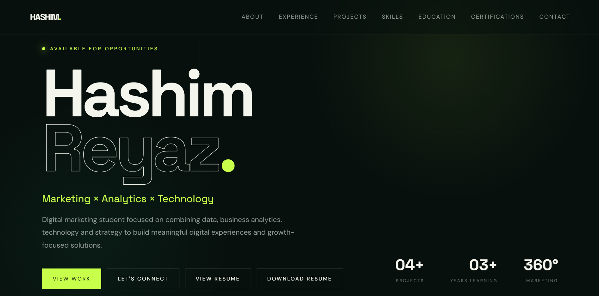

  

<h1 align="center">Hashim Reyaz</h1>

  <strong>Digital Marketing • Analytics • Web Development • Branding</strong>

  BBA Digital Marketing Student · SRM University

---

## About Me

I'm **Hashim Reyaz Baba**, a BBA Digital Marketing student interested in combining **marketing, technology, analytics, and business** to build practical digital solutions.

My work spans digital marketing, web development, data analysis, branding, entrepreneurship, and esports.

---

## Skills

**Marketing & Business**

Digital Marketing · Brand Strategy · Market Research · Business Strategy · Entrepreneurship · Social Media · Content Strategy · SEO

**Technology & Analytics**

HTML · CSS · JavaScript · Python · Data Analysis · Business Analytics · WordPress · AI Tools

**Creative**

Graphic Design · Content Creation · Esports Branding

---

## Education

**BBA — Digital Marketing**  
SRM University

**CGPA:** 8.0 / 10

---

## Certification

**AWS Academy Graduate — Generative AI Foundations**

[View Credential](https://www.credly.com/badges/3e141013-7bfd-449c-9a79-446151b0c5bc)

---

## Featured Work

This portfolio showcases work across:

- Digital Marketing
- Brand Development
- Web Development
- Data & Analytics
- Business Strategy
- Entrepreneurship
- Esports & Digital Branding

More projects will be added as I continue building.

---

## Portfolio

🌐 **website:**[Portfolio](https://hashimrbaba.netlify.app)

---

## Connect

📧 **Email:** hashimreyaz757@gmail.com

💼 **LinkedIn:** [Hashim Reyaz](https://www.linkedin.com/in/hashimrbaba/)

🐙 **GitHub:** [hashimreyaz](https://github.com/hashimreyaz)

---

  Built with HTML, CSS & JavaScript

  © Hashim Reyaz Baba

